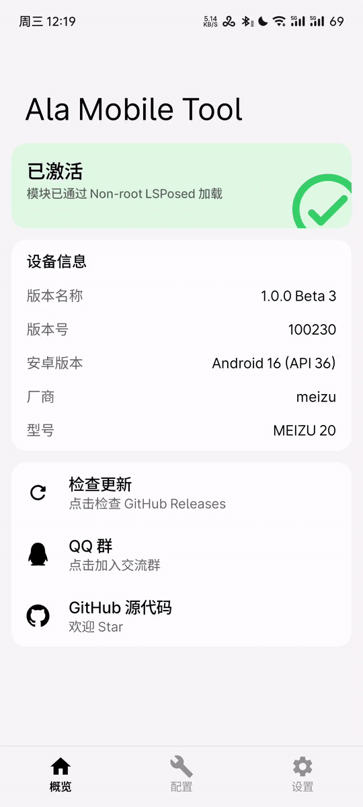

# Ala Mobile Tool

<p align="center">
  
  
  
  
</p>

<p align="center">
  <strong>Ala Mobile 的体验增强 LSPosed 模块</strong><br>
  线性踏板操控 &middot; 原生 TC 控制 &middot; 音乐替换 &middot; 内购解锁
</p>

---

## 演示

### 踏板拓扑

| 单踏板 | 双踏板 |
|---|---|
|  |  |

单踏板模式：手指在屏幕上下滑动，上半区控制油门、下半区控制刹车。

双踏板模式：左右两指分别控制独立的油门和刹车踏板。

### Overlay 控件

图标按钮可拖动，单击切换 Overlay 控件显示/隐藏，长按模块图标按钮进入编辑模式，拖拽移动 + 四角缩放各 Overlay 控件大小：


### 模块设置界面

miuix 风格三页布局（概览 / 配置 / 设置），支持深色模式：



---

## ⚠️ 免责声明

> 本模块仅供 **个人学习、技术研究与逆向工程教学** 使用。
>
> 它通过修改游戏运行时行为（内存读写、函数钩子、输入注入）来增强操控体验，**可能违反游戏服务条款并导致账号暂时或永久封禁**。请在单机模式下使用，并自行承担所有风险。原作者不承担任何直接或间接损失的责任。

首次启动模块设置界面时会弹出完整的 **用户协议弹窗**（EULA v2），需阅读并点击「同意」后才能使用。

---

## 功能

### ✅ 已实现

#### 线性踏板（Pedal Overlay）
- **三种拓扑**：关闭、单踏板（上半油门/下半刹车）、双踏板（独立油门/刹车控件）
- **响应曲线**：线性 / 自定义（多点控制点 + 保单调三次样条），油门和刹车可分别设置
- **死区与过渡点**：单踏板模式下可调油门/刹车交界处的无效范围（0-20%）和分界线位置（20-80%）
- **刹车优先仲裁**：双踏板模式下两指同时按下时，刹车值超过过渡点（默认 10%）则刹车优先屏蔽油门
- **刹车方向反转**：双踏板模式下刹车填充方向可切换（默认从下往上 / 反转后从上往下）

#### 主菜单音乐替换
- 将主菜单背景音乐替换为 **Hans Zimmer - F1**（320kbps）
- 默认开启。离开主菜单自动暂停，返回自动恢复
- 通过 native hook 静音游戏原生 `AudioSource.set_volume`，不依赖游戏设置

#### 布局编辑
- 长按工具按钮进入编辑模式
- 拖拽移动 + 四角缩放各 overlay 位置
- 长按编辑层重置到出厂默认位置
- 单踏板 / 双踏板模式的位置分别持久化，互不干扰

#### 内购解锁（Unlock / IAP Bypass）
- 双重锁定路径：**Native inline hook**（主路径）+ **Java 层 Xposed hook**（辅助路径）
- native 路径：`BillingManager.Awake` + `GetInstance`（兜底）+ 15 秒延迟 `forceUnlockNow` one-shot
- Java 路径：`BillingBridge.checkOwned` / `checkOwnedInternal` → 注入 `OnAlreadyOwned` 消息
- 首次解锁弹窗后写 `/data/data/<pkg>/files/ala_unlock_done.flag`，后续启动不再弹窗
- **关闭解锁开关时**仍 hook `Awake` 预设 `IsUnlocked=true` + 阻挡 `OnOwnedNone`/`OnPurchaseFailed` 弹窗，
  防止正版用户每次冷启动看到"Fresh unlock"弹窗，同时让游戏正常走 Google Play 查询流程

#### 原生 TC 控制
- 通过 hook `TractionFilter`（TC）在入口处决定是否跳过
- **TC 已生效**：关闭时 TractionFilter 直接返回原始 accel，不削减

#### 配置即时生效
- 三路配置同步：**Remote Preferences**（LSPosed daemon SQLite）→ **ConfigProvider**（ContentProvider）→ **定向广播**
- 游戏不运行时改配置：下次启动从 daemon 读取最新值，不再丢失
- 游戏运行时改配置：广播即时推送，overlay 重建生效

#### AI 车隔离
- 通过 `IRDSPlayerControls.Update()` 捕获玩家车 controller（该组件只挂在玩家车 GameObject 上）
- writer 线程只写 `g_player_controller`（由 `IRDSPlayerControls` 设置），不受 AI 车干扰
- 油门/刹车 hook 中 `is_player_controller` 检查 `playerControls` 字段（偏移 0x108）过滤 AI 车

#### 多框架兼容
- 支持 **LSPosed**（root）和 **NPatch**（非 root）框架
- NPatch 路径：通过 `content://top.nkbe.npatch.remote` ContentProvider 拿 remote service binder 读写配置
- LSPosed 共存版：`System.setProperty` 进程级标记避免双 ClassLoader 重复注入

#### LSPosed 激活检测
- 概览页实时显示激活状态（已激活 / 未激活）
- 判定依据 `service.frameworkName == "LSPosed"`：LSPosed daemon 只在模块启用时推 binder，绑定即激活（参照 AdClose `onServiceBind` 思路）
- NPatch 等非 root 框架（`frameworkName == "NPatch"`，API 101）不算 LSPOSED，自动弹窗确认（LSPatch/NPatch/FPA）

#### 现代 UI
- Miuix 风格三页布局（概览 / 配置 / 设置），支持深色模式
- 顶栏/底栏毛玻璃（blurRadius=12f），下滑顶栏折叠
- 内嵌 GitHub 与 QQ 群入口图标（SVG Path 渲染）

#### Tool Button（工具按钮）
- 96×96dp 圆角矩形按钮，前景为 App 图标（Base64 内嵌，绕过跨进程资源访问限制）
- 单击：切换 overlay 展开/折叠
- 长按：进入编辑模式
- 拖动：移动按钮自身位置（**不持久化**，每次打开游戏重置到默认位置）

#### 版本门控
- `VersionGate` 精准校验包名（原版 + 共存版）、`versionName` 和 `versionCode`
- 非 8.0.4（200146）版本拒绝加载 native hook，避免 IL2CPP 偏移不匹配导致崩溃

#### 用户协议（EULA）
- 强制确认弹窗，按版本号持久化（当前 v2），条款更新重新弹窗
- 存于模块进程 `filesDir`，`pm clear` / 卸载重装自动清除，语义正确
- 协议同意前激活弹窗不可见，保证协议优先

#### vivo/Android 16 兼容
- 所有重操作（ShadowHook 初始化、JNI 调用、Service 绑定）延迟到 `Handler.post` 下一主循环
- 避开 `createOrUpdateClassLoaderLocked` 内部 Resources 未初始化时序窗口

### 🚧 开发中

- **自动 DRS**：已完成 `drsToggle()` 拦截，telemetry 赛道数据解析待实现
- **手动换挡**：`DoGearShifting` hook 导致起步失败，需重新实现
- **原生 ABS 控制**：`HandleABS` 被编译器内联到 carController，hook 不触发。当前通过写 `absEnable` 字段（偏移 0xC4）实现，待找到未被内联的正确入口点后再做开关

---

## 安装

### 前提条件

- 一部已 root 的 Android 手机，安装了 **LSPosed**（或兼容分支）框架
- 已安装 **Ala Mobile 8.0.4**（versionCode 200146）

### 步骤

1. 从 [Releases 页面](https://github.com/TakotsuboChen/ala-mobile-tool/releases) 下载最新 APK
2. 安装 APK 到手机
3. 打开 **LSPosed Manager**，在模块列表中找到 **Ala Mobile Tool** 并启用
4. 在作用域中勾选 **Ala Mobile**（原版 `com.Vince.AlamobileFormula` 或共存版 `com.Takotsubo.AlamobileFormula`）
5. 启动游戏，进入后点击左上角工具按钮显示 overlay

> 💡 **首次使用**：建议先进入模块设置界面（打开模块 App）确认配置，再进入游戏。

### 非 root 用户（NPatch）

1. 安装 [NPatch](https://github.com/nkbe/npatch) 框架、共存版游戏与模块
2. 在 NPatch 中 Ala Mobile 的模块作用域勾选 Ala Mobile Tool

---

## 配置

在 LSPosed 模块列表中点击 **Ala Mobile Tool** 打开设置界面（三页布局）：

### 概览页
- 模块激活状态卡片（已激活 / 未激活，绿/红配色）
- 设备信息：版本名称、版本号、Android 版本、厂商、型号
- 链接：GitHub Releases、QQ 群、GitHub 源代码

### 配置页

| 分类 | 功能项 | 说明 |
|---|---|---|
| 功能开关 | 解锁付费内容 | 强制解锁 DLC 和 IAP（默认关闭） |
| | 牵引力控制（TC） | 启用原生 TC（默认开启） |
| | 替换主菜单音乐 | 更换为 Hans Zimmer - F1（默认开启） |
| Overlay 控件 | 显示悬浮窗 | 在游戏中显示踏板和换挡 overlay（默认开启） |
| | 线性踏板 | 拓扑选择：关闭 / 单踏板 / 双踏板 |
| | 死区（单踏板） | 0-20%，踏板过渡区域附近的无效范围 |
| | 过渡点（单踏板） | 20-80%，油门与刹车区域的分界线 |
| | 刹车过渡点（双踏板） | 0-20%，刹车优先仲裁的触发阈值 |
| | 刹车踏板方向反转（双踏板） | 切换填充方向 |
| 响应曲线 | 油门响应曲线 | 线性 / 自定义（多点控制点） |
| | 刹车响应曲线 | 线性 / 自定义（多点控制点） |

### 设置页

| 功能项 | 说明 |
|---|---|
| 启用日志 | 记录模块运行日志 |
| 导出并分享日志 | 导出当前日志文件并分享 |
| 清除激活标记 | 删除 Non-root 确认标记与 EULA 标记（filesDir，pm clear 可清） |
| 用户协议 | 重新查看并确认用户协议 |
| 关于 | 版本信息 |

---

## 已测试版本

| 版本 | versionCode | 架构 |
|---|---|---|
| 8.0.4 | 200146 | arm64-v8a |

> 其他版本请自行测试。IL2CPP 方法地址随版本变化，非匹配版本无法加载 native hook。

---

## 已知问题

- 自动 DRS 仅完成 `drsToggle()` 拦截，赛道数据自动判断尚未实现
- 手动换挡因 `DoGearShifting` hook 导致起步失败，**已暂时禁用**，待重新实现
- ABS 原生 hook（`HandleABS`）被编译器内联，当前通过写字段（偏移 0xC4）替代，开关尚未实现
- **弯道「顿挫」通常来自游戏内置的刹车辅助**，与模块无关，请在游戏设置中关闭辅助功能
- 共存版（重打包改包名）需配合双 ClassLoader 守卫，当前版本已修复

---

## 技术架构

```
Ala Mobile Tool (LSPosed 模块 APK)
├── ConfigActivity          # Compose + miuix 设置界面（模块进程）
├── AlaMobileModule         # Xposed 模块入口（游戏进程）
├── NativeBridge            # JNI 桥接（Java → C）
├── PedalOverlayView        # 双区踏板覆盖（Canvas View）
├── GearShiftView           # 换挡按钮（Canvas View）
├── ToolButtonView          # 工具按钮（Canvas View）
├── OverlayManager          # WindowManager 覆盖层管理
├── OverlayEditView         # 编辑模式拖拽/缩放层
├── MusicPlayer             # 主菜单音乐播放器（MediaPlayer + 轮询）
├── ConfigProvider          # 跨进程配置 IPC（ContentProvider）
├── ConfigReceiver          # 配置广播接收器
├── BillingHook             # Java 层内购解锁（Xposed hook）
├── LsposedStatus           # 激活状态判定（frameworkName 区分框架 + Non-root 弹窗确认）
├── EulaManager             # 用户协议管理
├── VersionGate             # 版本门控
└── libala-core.so          # ShadowHook 原生引擎（arm64-v8a）
    ├── pedal_hook          # 油门/刹车/换挡 + writer 线程
    ├── drs_hook            # DRS 拦截
    ├── unlock_hook         # BillingManager 解锁（主路径）
    └── music_hook          # 主菜单音乐静音 + 心跳检测
```

**技术栈：**
- 现代 libxposed API 102（min 101）
- Kotlin 2.4.10 + Jetpack Compose + miuix KMP 0.9.3
- ByteDance ShadowHook 2.0.1（UNIQUE 模式）
- C 语言 IL2CPP 运行时 inline hook
- AGP 9.3.1 / NDK 26.1.10909125 / Gradle 9.6.1

---

## 自行构建

需要 Android SDK（API 37）和 NDK r26c。

```bash
./gradlew :app:assembleDebug    # 调试构建
./gradlew :app:assembleRelease  # 发布构建（需签名配置）
./gradlew :app:lint             # 运行 lint（含 baseline）
```

**逆向工具：**
```bash
tools/run-il2cpp-dumper.sh
```

该脚本调用 [Il2CppDumper](https://github.com/Perfare/Il2CppDumper) 生成 `dump.cs`，用于提取目标方法偏移并更新 `OffsetTable.kt`。

---

## 路线图

- [ ] 自动 DRS：赛道 telemetry 解析 + 自动开关
- [ ] 手动换挡：重新实现 `DoGearShifting` hook
- [ ] 原生 ABS 开关：找到未被内联的正确入口点后接入
- [ ] 工具按钮位置持久化开关
- [ ] 多语言支持

---

## 社区与支持

- **GitHub Issues**：[报告 bug 或建议新功能](https://github.com/TakotsuboChen/ala-mobile-tool/issues)
- **QQ 群**：[加入玩家交流群](https://qun.qq.com/universal-share/share?ac=1&authKey=V0nuKHg0u%2BZKVi/jgDReAiZSCQdbMb0yMwaOSV49gejQWRtdz%2BG4G6eQQgWyFOJB&busi_data=eyJncm91cENvZGUiOiI3NTc5NDA3MDgiLCJ0b2tlbiI6IjVzRjZTTWpLckJIRExvRTk3K0QzVzJGK2N4QURRM2RwRjJWNkw0L29wcG9ocjI1NXo5T1hLZ2FJVkZXZkhlMVAiLCJ1aW4iOiIxMjU5OTc2NTIwIn0=&data=x1JvsLJUAovAdpfNmLQpuTN_-yGbUrMfCJ1VSQqD-QbIzj9-ZLiRKNEHNbJXpokkPhx5cc-RG47HyWYUrPBtTA&svctype=4&tempid=h5_group_info)
- 欢迎提交 Pull Request

---

## 许可证

本项目基于 **Apache License 2.0** 开源。详见 [LICENSE](LICENSE) 文件。

游戏名称、素材、商标版权归其各自所有者；与游戏开发商、发行商无任何关联或授权关系。

---

## 版本历史

<details>
<summary>展开查看</summary>

**v1.0.0 Beta 4**（2026-08-17）
> 新增自定义油门/刹车响应曲线编辑器（多点控制点 + 保单调三次样条）；修复配置修改后不立即生效（daemon 旧值覆盖新配置）、切换踏板模式后位置/大小丢失、native 库加载失败（移除 useLegacyPackaging）；适配 Ala Mobile 8.0.4（versionCode 200146，8.0.0 用户收到不支持警告）；底栏快速切换与切页掉帧修复。CI 自动构建 + tag 触发 Pre-release。

**v1.0.0 Beta 3**（2026-08-12）
> 配置页 UI 视觉大改。底栏切 tab 动画改为 KernelSU 式 `animateScrollBy`（连点不卡不错乱）；下滑顶栏折叠、标题居中；顶栏/底栏加毛玻璃（blurRadius=12f）；新增 miuix-blur 依赖。新增用户协议强制确认弹窗、配置页开关图标自定义、主菜单音乐替换（Hans Zimmer - F1，320kbps）、原生 TC 开关；修复 AI 车油门误控、LSPosed 激活判定误判（改 `frameworkName`）、NPatch 非 Root 配置跨进程同步、WSL2 Kotlin 编译卡死。真实设备已验证。

**v1.0.0 Beta 2**（2026-07-30）
> 踏板与配置体验大改。新增单/双踏板拓扑下拉、双踏板刹车优先仲裁与方向反转开关、长按重置出厂布局、SINGLE/DUAL 位置隔离持久化、配置即时生效（Remote Preferences 三路同步）；修复游戏自带方向键被 writer 持续清零导致的转向失灵；概览页激活卡片改为 KernelSU 风格对称配色，激活检测改用 LSPosed daemon 绑定状态。

**v1.0.0 Beta 1**（2026-07-29）
> 共存版稳定性大修。修复双 ClassLoader 注入导致的重复 hook/双 writer 线程；废除非原子的文件 IPC 路径，统一走 JNI 直调；用 rawY + 配置值坐标绕开 pairip 壳的 relayout 漂移。CI 自动构建 + tag 触发 Pre-release。

**v1.0.0 Alpha 2**（2026-07-28）
> UI 重构为 KernelSU 风格，修复多个编译错误，改进深色模式支持。

**v1.0.0 Alpha 1**（2026-07-28）
> 初始发布，包含踏板覆盖、换挡按钮和基础 DRS 拦截功能。

</details>
---

**Source URL:** https://github.com/TakotsuboChen/ala-mobile-tool
